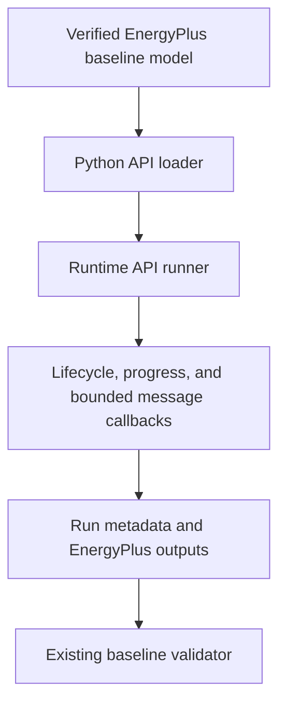
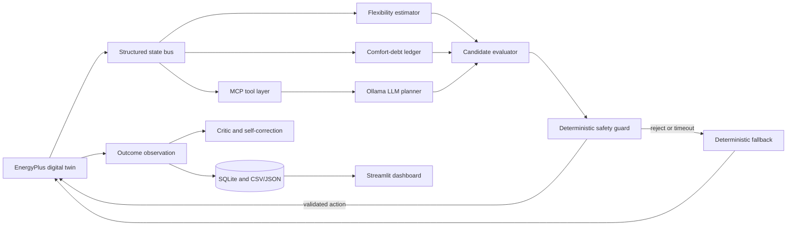
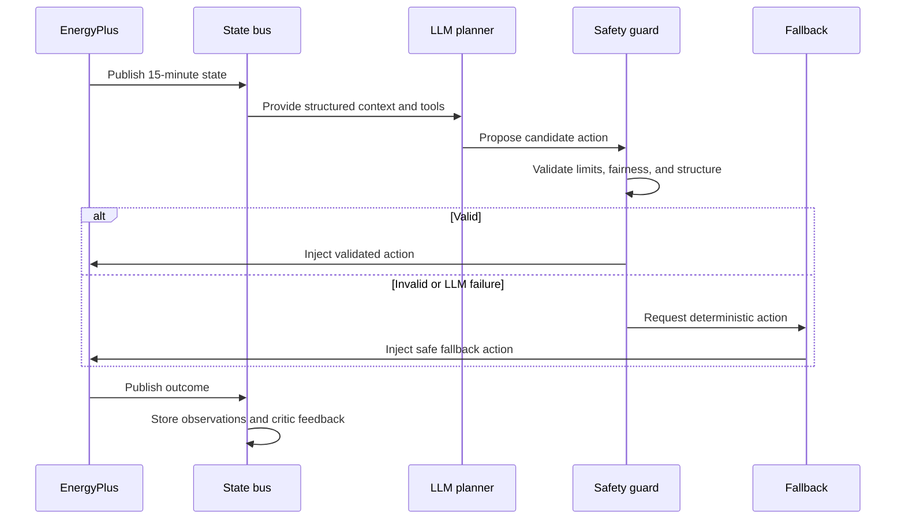

# Architecture

## Implemented execution path through Module 3



This implemented path starts the unchanged baseline and observes execution lifecycle only. It
does not yet read EnergyPlus variables, obtain actuator handles, control equipment, or invoke
AI.

## System architecture



## Closed-loop sequence



## Components and responsibilities

The EnergyPlus layer owns model execution, sensor reads, and actuator injection. The state bus normalizes observations. The controller layer coordinates the comfort-debt ledger, flexibility estimator, thermal-battery strategy, and candidate evaluator. The ledger tracks fairness over time; the estimator measures temporary zone flexibility; the evaluator compares strategy candidates.

The MCP tool layer exposes structured, bounded tools to the LLM planner. The critic reviews outcomes but does not bypass safety. SQLite and CSV/JSON store reproducible observations and exports; Streamlit will visualize them. Error and timeout handling rejects malformed or late proposals, logs the reason, and invokes deterministic fallback.

The LLM proposes actions. Deterministic code validates actions. Only validated actions may reach EnergyPlus. The fallback controller must work without the LLM.

## Evaluation architecture

Separate baseline and AI runs consume identical inputs and periods. Their stored outputs are compared afterward for energy, peak demand, comfort, reliability, and fairness; no simultaneous execution is required for the MVP.
# Implemented Module 4 read-only path

```text
EnergyPlus
    ↓
Data Exchange API
    ↓
Read-only sensor registry
    ↓
End-of-zone-timestep callback
    ↓
Timestamped sensor snapshot
    ↓
JSONL and CSV output
    ↓
Sensor validation
```

This Module 4 path remains observational; the separate bounded Module 5 test path
is shown below.

## Implemented Module 5 deterministic test path

```text
Live sensor state
       ↓
Deterministic test plan
       ↓
Approved single actuator
       ↓
Actuation callback
       ↓
set_actuator_value
       ↓
EnergyPlus physical response
       ↓
reset_actuator
       ↓
Normal EnergyPlus control resumes
       ↓
Sensor and event validation
```

This is a fixed actuator-functionality test. The Module 6 state bus and autonomous
control are not implemented.
