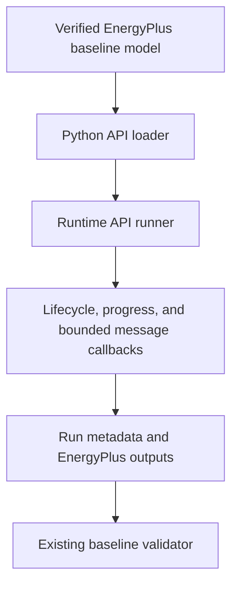
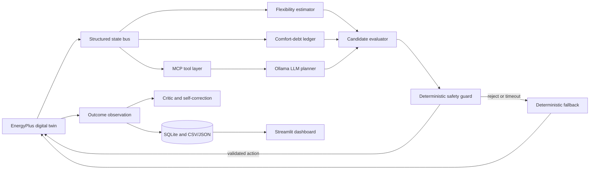
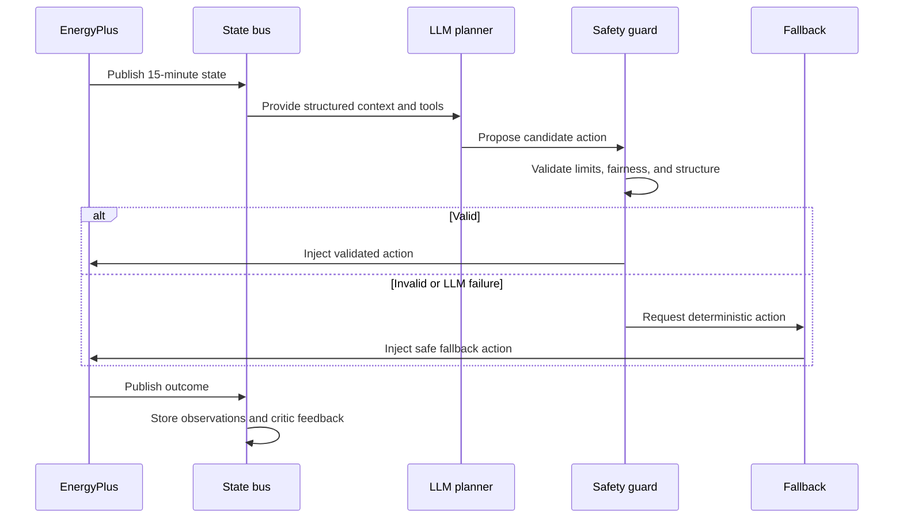

# Architecture

Module 15 adds a terminal read-only branch: persisted evidence → typed aggregation →
checksum-bound snapshot → loopback API → local dashboard, with no reverse execution path.

Module 12 inserts an offline MicroTwin after Module 11 plan generation: recorded telemetry -> causal dataset -> qualified JSON surrogate -> counterfactual plan rollouts -> deterministic ranking -> bounded MCP/LLM explanation. It has no path to EnergyPlus or the physical writer.

Module 12A adds a supervisor-owned required-evidence contract. Missing evidence triggers one correction, then a permitted deterministic prefetch labeled separately from model-selected calls. Neither path expands tool authority.

## Implemented execution path through Module 3



This implemented path starts the unchanged baseline and observes execution lifecycle only. It
does not yet read EnergyPlus variables, obtain actuator handles, control equipment, or invoke
AI.

## System architecture



## Closed-loop sequence



## Components and responsibilities

The EnergyPlus layer owns model execution, sensor reads, and actuator injection. The state bus normalizes observations. The controller layer coordinates the comfort-debt ledger, flexibility estimator, thermal-battery strategy, and candidate evaluator. The ledger tracks fairness over time; the estimator measures temporary zone flexibility; the evaluator compares strategy candidates.

The MCP tool layer exposes structured, bounded tools to the LLM planner. The critic reviews outcomes but does not bypass safety. SQLite and CSV/JSON store reproducible observations and exports; Streamlit will visualize them. Error and timeout handling rejects malformed or late proposals, logs the reason, and invokes deterministic fallback.

The LLM proposes actions. Deterministic code validates actions. Only validated actions may reach EnergyPlus. The fallback controller must work without the LLM.

## Evaluation architecture

Separate baseline and AI runs consume identical inputs and periods. Their stored outputs are compared afterward for energy, peak demand, comfort, reliability, and fairness; no simultaneous execution is required for the MVP.
# Implemented Module 4 read-only path

```text
EnergyPlus
    ↓
Data Exchange API
    ↓
Read-only sensor registry
    ↓
End-of-zone-timestep callback
    ↓
Timestamped sensor snapshot
    ↓
JSONL and CSV output
    ↓
Sensor validation
```

This Module 4 path remains observational; the separate bounded Module 5 test path
is shown below.

## Implemented Module 5 deterministic test path

```text
Live sensor state
       ↓
Deterministic test plan
       ↓
Approved single actuator
       ↓
Actuation callback
       ↓
set_actuator_value
       ↓
EnergyPlus physical response
       ↓
reset_actuator
       ↓
Normal EnergyPlus control resumes
       ↓
Sensor and event validation
```

This is a fixed actuator-functionality test. Autonomous control is not implemented.

## Implemented Module 6 state path

```text
EnergyPlus sensor callback
        |
SensorSnapshot
        |
State normaliser
        |
Canonical BuildingState
        |
Thread-safe StateBus
       /             \
Bounded history    Persistence worker
                          |
                    SQLite database
```

This implemented path is sensing-only. The future fallback, controller, comfort ledger,
LLM, and dashboard are not implemented by Module 6.

## Implemented Module 7 fallback path

## Implemented Module 8 safety boundary

## Implemented Module 9 MCP boundary

## Module 10 advisory supervisor boundary

Module 10A adds a user-facing runtime shell around this boundary: deterministic run
selection, validated request generation, real stdio calls, mock supervision, and bounded
audit inspection. It adds no new controller or physical path.

```text
Local model or mock -> bounded supervisor -> independent tool policy
    -> Module 9 MCP tools -> recorded evidence / Module 8 dry run -> no writer
```

The adapter accepts loopback Ollama only. Models cannot alter tool policy, limits,
evidence checks, or the zero-write final schema. Real-model smoke remains pending.

```text
Local MCP stdio client -> typed bounded tool envelope -> recorded Modules 6–8 stores
                                             |
                                             +-> Module 8 guard dry run -> no writer
```

The official MCP server uses a fixed catalogue and separate schema-v4 audit. Its only
control-capable tool is disabled, so no MCP path reaches the physical writer.

```text
Module 7 ControlCommand
        |
ProposedCommand
        |
Independent SafetyGuard
        |
GuardDecision -> schema-v3 audit
        |
GuardedCommand
        |
Runtime-validated physical write gate
        |
SPACE3-1 cooling-setpoint actuator
```

The writer accepts only guard-created immutable commands and rechecks authority, run,
environment, expiry, and exact actuator identity. Module 9 comfort-debt work remains pending.

```text
Canonical BuildingState
        |
Deterministic fallback decision engine
        |
ControlDecision
        |
Bounded latest-command buffer
        |
Single approved cooling actuator executor
        |
EnergyPlus
        |
Subsequent BuildingState observation
```

Module 8 — independent safety guard: **Completed**. Module 7 historical records contain minimal execution
invariants and is not an LLM-action safety boundary.
# Module 10 local inference boundary

The advisory model is `qwen3:0.6b` through loopback-only Ollama. Native model
tool selections are checked by deterministic schemas and policy before Module 9;
Module 8 remains the only proposal authority and the physical path is disabled.

Module 11 adds `PlanningContext -> deterministic templates -> validation -> first-action
Module 8 dry-run -> advisory scoring -> advisory selection`. Future plan actions never
become `GuardedCommand` objects; Module 12 MicroTwin work remains pending.
# Module 13 advisory layer

The Comfort Ledger consumes immutable planning context, candidate plans, and Module 12 rollouts. Deterministic evaluation produces ledger entries, debt records, fairness assessments, Thermal Bank accounting, and a ledger-aware ranking. Schema 8 persists these records additively. Ten MCP tools expose read/proposal-only access; the supervisor treats computed values as authoritative and keeps the control tool disabled. The layer has no path to the physical writer.

# Module 14 execution boundary

Exact approval binding and committed live state are new prerequisites before Module 8. Only the existing `PhysicalWriteGate` receives the guard-created command. Schema 9 stores approvals, sessions, transitions, actions, writer attempts, fallback/reset evidence, comparisons, and reconciliation. Four MCP tools expose records read-only; none can arm or execute.
